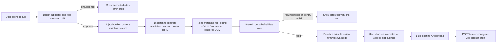

# Multi-site job importer plan

Recorded: 2026-08-23
Updated: 2026-08-24 to add Dice
Status: Planning only; no implementation changes are included in this document.
Recommended target release: `0.2.0`

## Goal and boundaries

Evolve the existing Manifest V3 extension from a Wellfound-only importer into a
finite, maintainable job-posting importer for exactly these sites:

- `wellfound.com`
- `linkedin.com/jobs`
- `indeed.com`
- `builtin.com`
- `dice.com`

The extension will continue to read the job currently selected on screen,
populate an editable review form, and create a compatible Job Tracker record
only after the user clicks **Create application**.

Out of scope for this phase:

- Any site not listed above
- Applying to jobs, clicking Apply, or filling employer application forms
- Reading cookies, credentials, browsing history, saved passwords, or browser
  profiles
- Following company links or making background requests to enrich missing data
- Guessing missing values from company profiles, recommendations, salary guides,
  search cards, or general web content
- Frontend or backend tracker changes unless later implementation discovers a
  concrete incompatibility

## Recommended decisions at a glance

1. Keep the existing tracker payload. Its `source` field is already free text,
   and every normalized field already fits the create schema.
2. Introduce one adapter per site behind a registry/dispatcher and move parsing
   rules into shared utilities.
3. Use Schema.org `JobPosting` JSON-LD when it is present and demonstrably
   belongs to the current job; use a site-scoped rendered-DOM fallback otherwise.
4. Build the modular extractor into one on-demand content-script bundle. Chrome
   serializes injected functions without their imported scope, so retaining the
   current `func:` approach would either force one large file or duplicate shared
   helpers in every adapter.
5. Continue using `activeTab` and `scripting`; do not add persistent host access
   for any job site.
6. Move the tracker address to a local options setting and request permission for
   only that configured origin. This removes machine-specific deployment data
   from tracked source and manifest files.
7. Preserve the current Interested/Applied workflow exactly: Interested is the
   default, has no application date, and sends `next_action: "Apply"`; Applied
   uses the chosen date and no default next action.

## Current architecture findings

### Extension

- The extension is plain HTML, CSS, and JavaScript with Manifest V3.
- `popup.js` currently performs a Wellfound-only URL check, injects the exported
  `scrapeWellfoundJob` function, fills the review form, builds the payload, and
  sends the API request.
- `src/extractor.js` is intentionally one self-contained function because a
  function passed to `chrome.scripting.executeScript` loses imported and outer
  lexical scope. All Wellfound helpers therefore live inside that function.
- `src/payload.js` and `src/api.js` are already site-neutral.
- The popup is compact, editable, defaults to Interested, and omits currency.
- Missing optional values are warnings; missing company or role title is fatal.
- Existing fixture tests cover Wellfound public pages, query/detail layouts,
  signed-in company pages, canonical URL recovery, missing fields, company-size
  mapping, and salary recommendation bleed.
- The manifest currently has only `activeTab`, `scripting`, and a hard-coded
  tracker host permission. The tracker origin is also hard-coded in
  `src/api.js`.

### Job Tracker API

No API change is currently justified. `POST /api/applications` already accepts:

- Required `company` and `role_title`
- Nullable `job_link`, `source`, `location`, `company_size`,
  `years_experience_min`, salary values, and `job_description`
- `interested` and `applied` statuses
- Nullable `date_applied`, `next_action`, and `next_action_date`

`source` is a nullable string rather than an enum, so `Wellfound`, `LinkedIn`,
`Indeed`, `Built In`, and `Dice` require no schema or migration. The extension
should continue omitting `salary_currency` as requested. The backend's current
default does not require the extension to send it.

### Representative live layout findings

The supplied pages were inspected read-only on 2026-08-23 and 2026-08-24. No
Apply button was clicked and no tracker record was created.

- **LinkedIn direct, signed in:** `/jobs/view/4454643971/` rendered a current-job
  detail page with company, role, location, and an **About the job** section. It
  exposed no `JobPosting` JSON-LD in the inspected DOM and also contained many
  personalized/related panels. The adapter therefore needs a tightly scoped DOM
  extractor.
- **LinkedIn search layout:** the supplied `currentJobId=4454643971` search page
  rendered result cards for other job IDs and did not expose a verified detail
  panel for `4454643971` in the inspected state. A URL parameter alone is not
  proof that the matching job is open. The adapter must bind the visible detail
  root to that ID or refuse extraction and offer the canonical direct URL.
- **Indeed direct, signed out:** the inspected `viewjob?jk=...` pages exposed a
  Schema.org `JobPosting` object containing role, employer, description, salary,
  and location. The rendered page also included a later **Company and salary
  information** area with generic salary links. That area must never be a salary
  source.
- **Built In direct, signed out:** the inspected pages exposed a `JobPosting`
  object inside JSON-LD. The visible page also placed a **Summary Generated by
  Built In** above the employer-provided description. The generated summary must
  not be stored as the job description or used to infer fields.
- **Dice direct, signed out:** all inspected `/job-detail/{uuid}` pages exposed a
  matching Schema.org `JobPosting` object with title, employer, UUID, canonical
  URL, employment type, description, location metadata, and pay metadata. Pay
  varied between numeric ranges, a single numeric value despite a visible range,
  and the nonnumeric string `Depends on Experience`, so structured data alone is
  not always complete enough for salary.
- **Dice unavailable jobs:** some supplied URLs showed **Sorry this job is no
  longer available** but retained structured data for that exact UUID. Their
  visible body was then dominated by **Similar Jobs** cards containing unrelated
  titles, descriptions, experience requirements, and salaries. The UUID match
  and an unavailable-job warning are essential.
- **Dice location:** one inspected hybrid posting rendered **Hybrid in New York,
  NY, US** while JSON-LD described it as `TELECOMMUTE` plus a New York place. The
  verified visible header is therefore needed to preserve Dice's more specific
  location wording.
- **Wellfound:** the current adapter already demonstrates why a single global
  body-text parser is unsafe: direct, dialog, and signed-in company-page layouts
  have different roots, and unrelated jobs can appear on the same page.

These observations are a starting point, not a promise that the sites' DOM will
remain stable. Reduced fixtures, explicit root validation, and graceful refusal
are required.

## Proposed architecture

### Data flow



### On-demand modular content script

Use a small build step (recommended: `esbuild`) only for the page extractor:

1. Source remains split into adapters and shared modules.
2. The build produces a classic isolated-world script such as
   `dist/extract-current-job.js`.
3. On popup open, `popup.js` first tries to message an already-installed
   extractor in the current document.
4. If no receiver exists, it injects the bundle with
   `chrome.scripting.executeScript({ files: [...] })` under the temporary
   `activeTab` grant, then sends the extraction message again.
5. The bundle installs its message listener once per document, dispatches by
   current URL, and returns only JSON-serializable data.

This keeps each adapter testable and prevents helper duplication while avoiding
manifest-declared content scripts and permanent access to the five job sites.
The generated bundle should be committed so a user can still clone and **Load
unpacked** without installing Node. CI or a build-check script must detect a
stale bundle.

### Site catalog and extractor registry

Use two related registries:

- A pure site catalog used by the popup: site ID, display name, tracker source,
  allowed hostnames/path shapes, and canonical URL recovery rules.
- An injected extractor registry: site ID to adapter function.

Both popup and injected code validate the URL. The popup validation provides a
fast friendly error; injected validation prevents an incorrect or stale site ID
from running against the wrong document.

Recommended source values:

| Site ID | Display/source value |
|---|---|
| `wellfound` | `Wellfound` |
| `linkedin` | `LinkedIn` |
| `indeed` | `Indeed` |
| `builtin` | `Built In` |
| `dice` | `Dice` |

### Common extraction result

Every adapter returns the same discriminated result:

```text
Success
  ok: true
  site_id
  layout: direct | side_panel | embedded
  job_id
  data:
    company
    role_title
    job_link
    source
    location
    company_size
    years_experience_min
    salary_min
    salary_max
    job_description
  warnings: [{ code, field, message }]

Failure
  ok: false
  site_id when known
  code
  error
  recovery_url when it can be derived safely
```

Only company and role title are universally required. Optional fields remain
`null`/blank with a field-specific warning. The popup converts structured
warnings to the current readable list. `layout`, `job_id`, warning codes, and
failure codes are diagnostic only and are not sent to the tracker.

### Shared utilities

Shared, pure utilities should cover:

- Text cleanup and safe HTML-to-plain-text conversion
- Schema.org graph traversal and `JobPosting` selection
- Canonical URL and site job-ID parsing
- Salary normalization from explicit job salary data only
- Conservative minimum-experience parsing
- Company-size band normalization to the tracker's existing enum
- Location formatting, including remote and multiple explicit locations
- Result construction, required-field checks, and warning generation

Utilities must accept a supplied document/root in tests and must not perform
network requests.

### Strict current-job and evidence policy

This is the primary correctness rule:

1. Parse the current job identity from the tab URL (`job ID`, LinkedIn numeric
   ID, Indeed `jk`, Built In numeric path ID, or Dice UUID).
2. Select a `JobPosting` node only when its URL/identifier matches that identity,
   or when a direct single-job page has one unambiguous `JobPosting` node and a
   matching visible title/company root.
3. On a search page, locate the active details root and require a self-link,
   identifier, or other stable site marker matching the requested/current job
   ID. If it cannot be proven, return an error rather than extracting the first
   card or the whole body.
4. Extract optional fields only from approved evidence locations inside that
   verified root. Never search `document.body.innerText` globally.
5. Do not use recommendation cards, salary-guide links, company-review salary
   panels, personalized fit summaries, or generated summaries.
6. Do not make a value plausible, convert one currency to another, infer company
   size from reputation, or infer location from company headquarters.
7. If explicit source data is malformed or ambiguous, return null plus a warning.

Field-specific conservative rules:

- **Salary:** prefer matching `JobPosting.baseSalary`; otherwise use only a
  labeled pay/compensation element in the verified job root. A scoped visible
  range may complete incomplete structured data, but unrelated salary cards may
  not. Preserve explicitly unusual numbers for user review rather than silently
  correcting them. If the source states an hourly/daily rate, leave the tracker's
  annual salary fields blank and warn; annualizing it would be an inference and
  the current payload has no pay-period field.
- **Experience:** prefer explicit site metadata. A description fallback may use
  clear required/minimum patterns inside a requirements/qualifications section;
  do not select arbitrary years from benefits, preferred skills, or company
  history. Leave blank when several requirements make the overall minimum
  ambiguous.
- **Company size:** map an explicitly stated number/range to the existing bands.
  If a source range crosses tracker band boundaries, leave it blank rather than
  choose a band.
- **Description:** store employer job-description content as plain text. Exclude
  site-generated summaries, application widgets, benefits extracted outside the
  description, related jobs, and company salary/review navigation.

## Site adapter plans

### Wellfound

- Move the existing behavior behind the new adapter interface without changing
  selectors or output first.
- Retain support for canonical pages, query-style detail dialogs, and signed-in
  company-profile job pages.
- Keep canonical recovery from `job_listing_slug` and company-page job paths.
- Preserve current salary scoping, company-size lookup, and every existing test
  before making any cleanup.
- Treat this adapter migration as the architecture's regression gate.

### LinkedIn

- Accept bare/`www` LinkedIn hosts only when the path is under `/jobs/`.
- Canonicalize a verified job to
  `https://www.linkedin.com/jobs/view/{numeric-id}/`, removing all tracking
  parameters.
- Direct layout: scope to the primary job-detail region; extract the h1/current
  role, linked employer, job location/metadata, and **About the job** content.
- Search/side-panel layout: obtain the requested ID from `currentJobId` or the
  active job link, then require the detail pane to reference the same ID.
- Ignore search-result cards, AI fit/cover-letter areas, people panels,
  promoted recommendations, and company-page content.
- Signed-in and signed-out markup should be separate fixture variants. If a
  signed-out page is an auth wall or lacks full details, return a clear request
  to open the complete job rather than scraping the auth page.
- Expect company size and salary to be absent frequently; leave them blank.
- Risk level: highest, due authenticated/personalized DOM and frequent markup
  changes.

### Indeed

- Accept bare/`www.indeed.com` `viewjob` pages and supported search/detail-panel
  pages that expose a `jk` for the active job.
- Canonicalize to `https://www.indeed.com/viewjob?jk={jk}`, dropping `from`,
  `cmp`, `tk`, advertising, and other tracking parameters.
- Prefer the matching Schema.org `JobPosting` object for role, organization,
  location, salary, and description.
- Use labeled rendered **Job details**, **Pay**, and **Full job description**
  elements only as a fallback.
- Explicitly exclude **Company and salary information**, salary/review links,
  similar-title sections, career guides, and neighboring result cards.
- For a search/detail panel, require the root or structured job data to match the
  active `jk` before returning anything.
- Risk level: medium; JSON-LD is strong when present, but experiments, sponsored
  pages, expired jobs, and bot/interstitial pages require graceful errors.

### Built In

- Accept bare/`www.builtin.com` paths matching `/job/{slug}/{numeric-id}`.
- Canonicalize to the same path with query and fragment removed.
- Prefer the matching `JobPosting` inside a JSON-LD object or `@graph`.
- Use the visible current-job header and employer description as fallback.
- Exclude **Summary Generated by Built In**, fit-analysis widgets, company
  insight/FAQ areas, team testimonials, and other jobs.
- Preserve multiple explicit job locations in a readable tracker string; do not
  substitute a company office list for a job location.
- No distinct side-panel layout was observed in the supplied examples. If Built
  In introduces or exposes one during fixture capture, it must pass the same
  current-ID validation before being supported; otherwise direct pages are the
  relevant layout for this phase.
- Risk level: low-to-medium while matching JSON-LD exists; generated summaries
  and page redesigns are the main bleed risks.

### Dice

- Accept bare/`www.dice.com` paths matching `/job-detail/{uuid}`.
- Canonicalize to `https://www.dice.com/job-detail/{uuid}`, removing query and
  fragment data.
- Require `JobPosting.identifier.value` and/or `JobPosting.url` to match the UUID
  in the active tab before using structured data.
- Prefer the matching `JobPosting` for role, employer, description, employment
  type, and raw location/pay evidence. Use only the verified current-job header
  to preserve more specific visible location wording or complete an annual
  salary range that JSON-LD truncates.
- Treat `Depends on Experience` and other nonnumeric pay values as missing with a
  warning. Treat hourly/daily pay as unstorable under the current annual-only
  tracker model; do not annualize it.
- If Dice marks the current job unavailable but matching structured data remains,
  populate the review form with a prominent unavailable-job warning. Never fall
  through to **Similar Jobs**.
- Exclude **Dice Job Match Score**, Fitment, job alerts, recruiter/profile cards,
  company information, **Similar Jobs**, and Dice's AI-use disclaimer from the
  stored job description.
- The supplied Dice examples were direct job-detail pages, and Dice search pages
  appear card-oriented rather than exposing a distinct selected-job panel. Add a
  side-panel variant only if an actual rendered layout is captured and its UUID
  can be proven.
- Signed-out direct pages were accessible. Capture a separate signed-in fixture
  if signed-in markup materially changes the verified job root; do not access
  account data or the personalized match score.
- Risk level: medium; JSON-LD identity is strong, but incomplete salary metadata,
  hybrid/remote wording, unavailable jobs, and prominent related cards require
  site-specific merging and decoy tests.

## Popup and configuration changes

Generalize user-facing names:

- Extension name: **Job Posting to Job Tracker**
- Action title: **Save job to Job Tracker**
- Popup heading: **Save job** or dynamically **Save {site} job**
- Generic loading, unsupported-site, incomplete-detail, and recovery text

Keep the same editable fields and compact layout. `source` is populated from the
registry but remains reviewable. Preserve status/date behavior, duplicate-submit
protection, warnings, retry behavior, and success linking.

Replace tracked deployment constants with an options page:

- Store only the normalized tracker origin in `chrome.storage.local` (not sync).
- Accept only `http:` or `https:` origins with no credentials, query, or fragment.
- Request runtime permission for exactly `{configured-origin}/*` from the user's
  settings-page gesture.
- When unconfigured, the popup shows a **Configure Job Tracker** link and makes
  no request.
- Changing the tracker origin requests the new origin and offers to remove the
  old optional permission.
- Keep the real LAN address and local path only in ignored `LOCAL_CONTEXT.md`.

## Chrome permissions and privacy

Recommended manifest permissions:

- Keep `activeTab`: temporary access only after the user opens the popup.
- Keep `scripting`: inject the extractor bundle into that selected tab.
- Add `storage`: save the tracker origin locally on this Chrome profile.
- Replace the hard-coded tracker `host_permissions` entry with optional host
  patterns capable of covering a user-entered HTTP(S) tracker. At runtime,
  request only the exact configured origin. Optional origins do not grant
  access until the user approves the request.

Do not request:

- Persistent host permission for Wellfound, LinkedIn, Indeed, Built In, or Dice
- `<all_urls>` as a granted permission
- `cookies`, `history`, `webRequest`, `identity`, downloads, or clipboard access
- A persistent background service worker

The content script runs in Chrome's isolated world, reads the rendered DOM only
after a toolbar gesture, and returns the extracted plain data to the popup. It
does not read cookie values even when the page itself is signed in. The only
network request made by the extension is the explicit create request to the
configured tracker after the user reviews and submits the form. A LAN tracker
may still trigger Chrome's Local Network Access prompt.

## Planned file changes

### Add

- `src/sites/catalog.js` — supported host/path detection, display/source names,
  and canonical recovery metadata
- `src/adapters/index.js` — injected registry/dispatcher
- `src/adapters/wellfound.js`
- `src/adapters/linkedin.js`
- `src/adapters/indeed.js`
- `src/adapters/builtin.js`
- `src/adapters/dice.js`
- `src/extraction/result.js` — common success/failure schema and validation
- `src/extraction/normalize.js` — shared text, number, salary, experience,
  company-size, and location helpers
- `src/extraction/job-posting-jsonld.js` — safe Schema.org graph parsing and
  current-job matching
- `src/content-script.js` — guarded message listener and dispatch entry point
- `src/config.js` — tracker-origin validation/storage/permission helpers
- `options.html`, `options.css`, `options.js` — local tracker configuration
- `scripts/build.mjs` — deterministic extractor bundle generation
- `dist/extract-current-job.js` — committed generated bundle for Load unpacked
- `tests/fixtures/README.md` — fixture provenance, layout, sanitization, and
  refresh rules
- Per-site reduced fixtures under `tests/fixtures/{site}/`
- Per-site adapter tests under `tests/adapters/`
- `tests/catalog.test.js`, `tests/normalize.test.js`,
  `tests/job-posting-jsonld.test.js`, `tests/config.test.js`, and a popup flow
  test with mocked Chrome APIs
- `docs/TESTING.md` and `docs/EXTRACTION_RULES.md`

### Modify

- `manifest.json` — generic metadata, options page, `storage`, and optional
  tracker-origin permission model; retain Manifest V3 and active-tab injection
- `popup.html`, `popup.css`, `popup.js` — generic site UI, registry detection,
  on-demand content-script messaging, and configuration state
- `src/api.js` — consume the configured origin instead of a tracked constant
- `src/payload.js` — no data-contract change; only site-neutral naming/tests if
  needed
- `package.json` — rename package, add build/check scripts, and pin the bundler
- `README.md` — supported sites, configuration, build/reload instructions,
  privacy, limitations, and troubleshooting
- `CONTEXT.md` — site-neutral integration contract, adapter invariants, and
  maintenance notes
- `.gitignore` — keep `LOCAL_CONTEXT.md` ignored; add only transient build/test
  outputs, not the committed bundle

### Rename or move with history preserved

- `src/extractor.js` -> `src/adapters/wellfound.js`
- `tests/extractor.test.js` -> `tests/adapters/wellfound.test.js`
- `PLAN.md` -> `docs/history/WELLFOUND_INITIAL_PLAN.md` after this plan becomes
  the active implementation plan
- Recommended repository/package identity:
  `chrome-extension-job-tracker`; recommended product name:
  **Job Posting to Job Tracker**

### Remove

- Remove the hard-coded tracker address from tracked source and manifest files.
- Do not delete historical plans or maintainer context; move/sanitize public
  history and retain machine-specific details in ignored `LOCAL_CONTEXT.md`.

## Implementation phases

### Phase 0 — Freeze the baseline and capture fixtures

1. Run and record the current 17-test Wellfound baseline.
2. Tag or commit the working Wellfound release as `v0.1.5` before structural
   changes.
3. Capture reduced, sanitized fixtures from the supplied URLs, one per distinct
   rendered layout rather than redundant full-page copies.
4. Record source URL/job ID, access state, layout, and capture date in the fixture
   manifest. Remove personal navigation/profile data from signed-in fixtures.

Exit condition: the existing behavior and the evidence used to add new sites
are reproducible without live network access.

### Phase 1 — Shared contracts, build, generic UI, and local configuration

1. Add the normalized result contract, site catalog, shared utilities, bundler,
   and content-script message bridge.
2. Generalize manifest and popup names while preserving the form behavior.
3. Add the options-page tracker configuration and exact-origin permission flow.
4. Add build freshness, catalog, config, and popup flow tests.

Exit condition: the extension can detect supported sites generically, rejects
unsupported pages, and can reach a user-configured tracker, but Wellfound output
is still unchanged.

### Phase 2 — Migrate Wellfound behind the adapter registry

1. Move the existing extractor and tests with minimal functional edits.
2. Route Wellfound through the same injected bundle and normalized result used by
   future adapters.
3. Run every prior regression plus popup/payload/API tests.
4. Perform a read-only manual check on the previously troublesome Wellfound
   layouts.

Exit condition: no Wellfound regression and no remaining Wellfound-only branch
in popup orchestration.

### Phase 3 — Add Built In

1. Implement matching JSON-LD extraction and DOM fallback.
2. Add direct-page, generated-summary decoy, missing-field, malformed JSON-LD,
   canonicalization, and unrelated-content tests.
3. Confirm whether any supplied/current search layout has a real side panel; add
   it only with a current-ID fixture.

Exit condition: supplied direct pages populate the review form without storing
the generated summary or unrelated company content.

### Phase 4 — Add Dice

1. Implement UUID matching, canonicalization, and `JobPosting` extraction.
2. Add narrowly scoped DOM completion for visible annual salary ranges and
   Dice-specific location wording.
3. Add unavailable-job, nonnumeric/hourly pay, incomplete structured salary,
   hybrid location, match-score, and **Similar Jobs** decoy tests.

Exit condition: every supplied Dice URL either populates the matching job with
appropriate warnings or returns a current-job-specific error, and no related job
can supply a field.

### Phase 5 — Add Indeed

1. Implement `jk` identity/canonicalization and matching `JobPosting` extraction.
2. Add rendered direct and search/detail-panel fallbacks only within a verified
   current-job root.
3. Add explicit decoys for company salary links, similar jobs, and other result
   cards.

Exit condition: all supplied `viewjob` URL shapes reduce to stable canonical
links, and only explicit current-job pay is returned.

### Phase 6 — Add LinkedIn

1. Implement signed-in direct DOM extraction.
2. Implement search/side-panel extraction with strict `currentJobId` matching and
   a direct-page recovery URL.
3. Add signed-out/public or auth-wall behavior when an accessible fixture can be
   captured.
4. Add personalized panels, unrelated search cards, and mismatched-current-ID
   decoys.

Exit condition: both direct and verified open-panel layouts work, while a search
page with no matching open details is rejected rather than misread.

### Phase 7 — Hardening, documentation, migration, and release

1. Run the full automated suite and deterministic build check.
2. Perform a read-only Chrome smoke matrix for every accessible site/layout and
   one deliberate create smoke test per source against the configured tracker.
3. Update public docs, local ignored context, and troubleshooting guidance.
4. Rename the product/package/repository with redirects or updated remotes noted
   in the migration guide.
5. Release as `0.2.0` after acceptance criteria pass.

## Test strategy and fixtures

### Fixture policy

- Commit small HTML fragments, not entire downloaded pages.
- Keep only the current job root, identity marker/URL, required structured data,
  and the minimum surrounding decoys needed by the test.
- Remove scripts, tracking tokens, user names, profile images, messages, and
  other signed-in personal data.
- Never store cookies, request headers, local storage, or credentials.
- Give each fixture a manifest entry with site, job ID, layout, signed-in/out
  state, capture date, source example, and what regression it represents.
- Live pages are for read-only smoke checks; deterministic tests never require
  network access.

### Representative fixture matrix

| Site | Required fixtures |
|---|---|
| Wellfound | Existing canonical public, query dialog, generic landing/recovery, signed-in company layout, missing experience, company-size sidebar, unrelated salary decoy |
| LinkedIn | Signed-in direct, signed-in search panel, mismatched or absent panel for `currentJobId`, signed-out public when accessible, auth wall/incomplete detail, related-card salary/experience decoys |
| Indeed | Signed-out direct with valid JSON-LD, direct DOM fallback, malformed/multiple JSON-LD, search/detail panel with matching `jk`, mismatched `jk`, missing pay, company-salary and similar-job decoys |
| Built In | Direct JSON-LD graph, DOM fallback, malformed/multiple JSON-LD, generated-summary decoy, multiple locations, missing salary/experience, related company/jobs decoys |
| Dice | Active direct with matching JSON-LD, unavailable direct with retained JSON-LD, malformed/mismatched UUID, `Depends on Experience`, hourly range, incomplete numeric salary, hybrid location, Dice Match Score, recruiter/company content, and Similar Jobs salary/experience decoys |

Use the supplied URLs to capture all distinct templates. Multiple URLs that
render the same template can share one structural fixture plus separate
canonicalization parameter cases.

### Automated layers

1. **Pure utility tests:** URL/job-ID parsing, JSON-LD graph traversal, HTML to
   plain text, salary, experience, location, company-size boundaries, and
   malformed inputs.
2. **Adapter fixture tests:** each layout returns the common schema, correct
   source/canonical URL, and only current-job data.
3. **Adversarial regressions:** place a more attractive salary, title, years, or
   company size in recommendations and assert it is never selected.
4. **Contract tests:** every success has company/role/source/canonical URL;
   missing optional values generate structured warnings; identity mismatch or
   missing required fields fails.
5. **Popup tests:** supported/unsupported detection, inject-and-message flow,
   editable values, Interested/Applied behavior, recovery links, missing config,
   permission denial, retries, and duplicate-submit prevention.
6. **Payload/API tests:** retain current tests and add one source case per site;
   assert Interested sends `next_action: "Apply"`, Applied sends its date, and
   currency is absent.
7. **Build test:** create the committed bundle from clean source and fail if the
   checked-in artifact differs.
8. **Manual smoke matrix:** current Chrome, direct and applicable side-panel
   layouts, accessible signed-in/out states, missing fields, popup viewport, and
   one deliberate tracker create per source.

## Documentation, versioning, and migration

- Keep `MULTI_SITE_PLAN.md` as the active plan until release; then retain it as
  implementation history.
- Preserve the initial Wellfound plan under `docs/history/` rather than deleting
  it.
- Keep `CONTEXT.md` as durable public architecture/integration context, rewritten
  to be site-neutral.
- Keep `LOCAL_CONTEXT.md` ignored and update it with the actual workspace path,
  LAN tracker origin, and local smoke-test notes after any folder rename.
- Public docs must use placeholders and examples only; do not mention the real
  workstation path or LAN address.
- Explain the new one-time tracker setup and runtime permission prompt in the
  README.
- Explain the build step but keep the generated bundle committed so non-developer
  users can still load the repository directly.
- Use `0.2.0` because this is a backward-compatible but substantial pre-1.0
  feature expansion. Keep `0.1.5` as the Wellfound-only rollback point.
- Recommended repository rename: `chrome-extension-job-tracker`. GitHub normally
  redirects the old remote after a repository rename, but local remotes and README
  links should still be updated explicitly.
- For an existing unpacked installation, update the same directory and reload it
  in `chrome://extensions` when possible. The first `0.2.0` launch will require
  entering the tracker origin once. Renaming the local extension directory may
  cause Chrome to treat it as a new unpacked extension, so do that only after the
  migration note is published.

## Site-specific maintenance risks

| Site | Main risks | Mitigation |
|---|---|---|
| Wellfound | Multiple detail roots and layout changes | Preserve current semantic anchors, recovery URLs, and regressions |
| LinkedIn | Personalized signed-in DOM, experiments, auth walls, unrelated result cards | Strict current-ID/root validation, separate layout fixtures, direct-link recovery, fail closed |
| Indeed | Interstitials/experiments, multiple `JobPosting` objects, generic salary pages near the job | Match `jk`, prefer matching JSON-LD, labeled-root fallback, strong decoy tests |
| Built In | Generated summary adjacent to description, JSON-LD graph changes, multiple locations | Match path ID, prefer employer description in `JobPosting`, exclude summary/widgets, DOM fallback fixtures |
| Dice | Unavailable pages dominated by related cards, nonnumeric/hourly/incomplete salary data, conflicting hybrid/remote labels | Match UUID before extraction, combine only scoped current-job evidence, warn on unavailable/unstorable pay, strong Similar Jobs decoys |

All five sites can change without notice. A selector failure should produce a
reviewable warning or clear error, never silently substitute unrelated content.

## Acceptance criteria

- All existing Wellfound tests and behaviors continue to pass through the new
  adapter path.
- Each supported hostname/path is recognized; every other site is rejected with
  a message listing the five supported sources and no script/request is run.
- Direct job pages and every applicable captured side-panel layout populate the
  common review form.
- Accessible signed-in and signed-out variants are covered; inaccessible/auth-wall
  pages fail clearly without authentication automation.
- Company and role are required. Missing optional values remain blank/null and
  appear as warnings.
- Every returned field is tied to the verified current job. Identity-mismatch and
  unrelated-content fixtures cannot contribute any values.
- Canonical links are stable and stripped of tracking parameters:
  Wellfound canonical job path, LinkedIn `/jobs/view/{id}/`, Indeed
  `/viewjob?jk={jk}`, Built In `/job/{slug}/{id}`, and Dice
  `/job-detail/{uuid}`.
- `source` is exactly `Wellfound`, `LinkedIn`, `Indeed`, `Built In`, or `Dice`.
- The editable review step, compact popup, Interested default, Applied date, and
  Interested `next_action: "Apply"` behavior are unchanged.
- The API payload remains compatible and omits currency.
- No job-site host permission, cookies/history permission, remote code, page
  mutation, Apply automation, or background enrichment is introduced.
- The tracker origin is locally configured, its exact permission is user-granted,
  and no machine-specific path or address remains in tracked files.
- The build is reproducible, the committed bundle is current, all automated tests
  pass, and the manual smoke matrix is recorded before `0.2.0`.

## Open questions and confirmed decisions

Open product/repository choices before implementation:

1. Confirm the recommended visible product name: **Job Posting to Job Tracker**.
2. Confirm the one-time options-page tracker configuration and exact-origin
   runtime permission model. It is the cleanest way to remove the LAN address
   from tracked files while keeping the extension reusable.
3. Confirm that the generated extractor bundle should be committed. This plan
   recommends yes so **Load unpacked** remains beginner-friendly.
4. LinkedIn signed-out support depends on obtaining a public/incomplete/auth-wall
   fixture without disturbing the user's signed-in session. If no full public
   layout is accessible, the release should explicitly support signed-in direct
   and verified side-panel layouts and gracefully reject the auth wall.

Confirmed project decisions:

- **Repository identity (confirmed 2026-08-24):** the GitHub repository and local
  folder are named `chrome-extension-job-tracker`, and the npm package uses the
  same name.

Confirmed Dice decisions:

- **Pay behavior (confirmed 2026-08-24):** do not populate `salary_min` or
  `salary_max` for hourly/daily pay because the tracker has no pay-period field;
  show the original rate in a warning and retain it in the job description.
- **Unavailable jobs (confirmed 2026-08-24):** a page explicitly marked
  unavailable may still populate the review form from matching structured data,
  with a prominent warning. Several supplied examples retain the complete
  current-job record even though the rendered page emphasizes recommendations.

No tracker frontend/backend change, new site permission, credential access, or
application automation is currently required.

## Primary Chrome references

- `activeTab`: <https://developer.chrome.com/docs/extensions/develop/concepts/activeTab>
- `chrome.scripting`: <https://developer.chrome.com/docs/extensions/reference/api/scripting>
- Content scripts and self-contained injected functions:
  <https://developer.chrome.com/docs/extensions/develop/concepts/content-scripts>
- Schema.org `JobPosting`: <https://schema.org/JobPosting>
